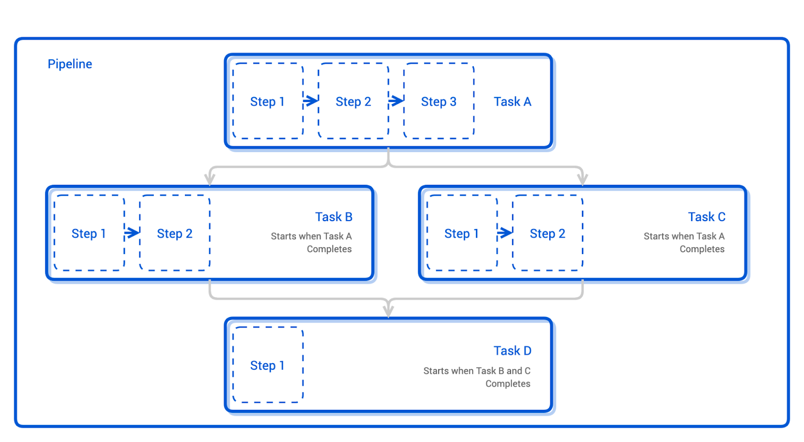
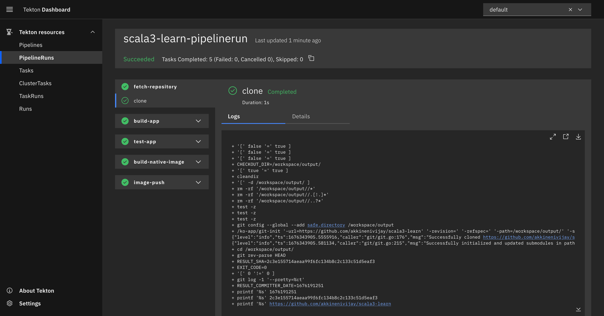

# Scala Learning Series: 2 - Build Scala 3 project using Tekton

In this article I will show how to setup a scala3 project build process that generates a native image using [Tekton](https://tekton.dev/), [GraalVM](https://www.graalvm.org/) and [SBT](https://www.scala-sbt.org/).

## Tekton CICD

Tekton is a powerful cloud native open source framework for CI/CD pipelines, allowing developers to build, test and deploy across cloud providers. Tekton installs and runs as an extension on a Kubernetes cluster and comprises a set of Kubernetes Custom Resources Definitions(CRD) that define the building blocks you can create and reuse for your pipelines.

### Tekton Terminology

- Task
  - A Task is a collection of Steps that you define and arrange in a specific order of execution as part of your continuous integration flow. A Task executes as a Pod on your Kubernetes cluster.
- Pipeline
  - A Pipeline is a collection of Tasks that you define and arrange in a specific order of execution as part of your continuous integration flow.
- TaskRun
  - A TaskRun allows you to instantiate and execute a Task on-cluster.
- PipelineRun
  - A PipelineRun allows you to instantiate and execute a Pipeline on-cluster.
- Workspaces
  - Workspaces allow Tasks to declare parts of the filesystem that need to be provided at runtime by TaskRuns.



### Installing Tekton

Lets start by installing Tekton on K8 cluster.

```shell
// Create a local k8 cluster for testing
kind create cluster

// Install Tekton Pipelines and its dependencies
kubectl apply --filename https://storage.googleapis.com/tekton-releases/pipeline/latest/release.yaml

// Install Tekton Triggers and Interceptors if you want to create a pipeline that gets triggers of PR request.
kubectl apply --filename https://storage.googleapis.com/tekton-releases/triggers/latest/release.yaml
kubectl apply --filename https://storage.googleapis.com/tekton-releases/triggers/latest/interceptors.yaml

// Install tekton tasks from tekton hub which will aloows us to checkout git and build contianer images
kubectl apply -f https://raw.githubusercontent.com/tektoncd/catalog/main/task/git-clone/0.9/git-clone.yaml
kubectl apply -f https://raw.githubusercontent.com/tektoncd/catalog/main/task/kaniko/0.6/kaniko.yaml
```

### Continuous Integration using Tekton

Lets create a pipeline that allows us to perform series of tasks below.

- Checkout a git scala project.
- Compile our scala project using sbt.
- Run tests.
- Build native image using GraalVM.
- Push native image to registry.

#### [PipelineRun](https://tekton.dev/docs/pipelines/workspaces/#specifying-workspaces-in-pipelineruns)

A PipelineRun allows you to instantiate and execute `scala3-learn-pipeline` Pipeline on-cluster.

The pipelinerun `scala3-learn-pipelinerun` defines a `workspace` which allows our source code to be shared between tasks. In the below definition a volumeClaimTemplate is provided for how a PersistentVolumeClaim should be created for a workspace named `scala3-learn-workspace`. Note that when using volumeClaimTemplate a new PersistentVolumeClaim is created for each PipelineRun. We also define a `secret volume` readonly workspace called docker credentials which holds docker registry credentials.

```yaml
apiVersion: tekton.dev/v1beta1
kind: PipelineRun
metadata:
  name: scala3-learn-pipelinerun # The name of the pipeline.
spec:
  pipelineRef:
    name: scala3-learn-pipeline # refer to the pipeline above
  podTemplate:
    securityContext:
      fsGroup: 65532
  params:
    - name: git_revision
      value: HEAD
  workspaces:
    - name: scala3-learn-workspace # The workspace used in the pipeline
      volumeClaimTemplate:
        spec:
          accessModes:
            - ReadWriteOnce
          resources:
            requests:
              storage: 25Gi # Amount of storage used 
    - name: docker-credentials
      secret:
        secretName: docker-credentials
```

Docker credentials config.json base64 encoded is loaded as k8 secret. This secret is used to publish the native image to docker registry of choice. Save the below yaml as docker-hub-secret.yml.

```yaml
apiVersion: v1
kind: Secret
metadata:
  name: docker-credentials
data:
  config.json: ewogICJhdXRocyI6IH......
```

```shell
// Prints config.json as base64 encoded.
cat ~config.json | base64

// apply docker secret
kubectl apply -f docker-hub-secret.yml
```

#### Pipeline

A Pipeline is a collection of Tasks that you define and arrange in a specific order of execution as part of your continuous integration flow.

```yaml
apiVersion: tekton.dev/v1beta1
kind: Pipeline
metadata:
  name: scala3-learn-pipeline # The name of the pipeline
spec:
  workspaces:
  # attach a volume to store source code. physical definitions of these workspaces are in PipelineRun.
    - name: scala3-learn-workspace 
    - name: docker-credentials
  tasks:
    - name: fetch-repository # The name of the first task
      taskRef:
        name: git-clone # The task this pipeline should run first (git-clone task)
      workspaces:
        - name: output
          workspace: scala3-learn-workspace
      params:
        - name: url
          value: https://github.com/akkinenivijay/scala3-learn # The GitHub repository
        - name: subdirectory
          value: ""
        - name: deleteExisting
          value: "true"
    - name: build-app
      taskRef:
        name: build-app
      runAfter:
        - fetch-repository
      workspaces:
        - name: source
          workspace: scala3-learn-workspace
    - name: test-app
      taskRef:
        name: test-app
      runAfter:
        - build-app
      workspaces:
        - name: source
          workspace: scala3-learn-workspace
    - name: build-native-image
      taskRef:
        name: build-native-image
      runAfter:
        - test-app
      workspaces:
        - name: source
          workspace: scala3-learn-workspace
    - name: build-push
      runAfter: ["build-native-image"]
      taskRef:
        name: kaniko
      workspaces:
      - name: source
        workspace: scala3-learn-workspace
      - name: dockerconfig
        workspace: docker-credentials
      params:
      - name: IMAGE
        value: vijayakkineni/scala3learn:latest
```

Every Pipeline has the following:

- workspaces - the workspaces shared by the tasks in the Pipeline.
- tasks - one or more Tasks that needs to be executed as part of the Pipeline

In this pipeline we have five Tasks `fetch-repository`, `build-app`, `test-app`, `build-native-image` and `image-push` that will be run to build the application from sources and push the built linux container image to dockerhub.

By default all Tasks of the Pipeline runs in parallel, you can control the execution via runAfter attribute. In this example we make all the tasks to run in a sequence.

Each Task in the Pipeline has

- taskRef - the reference to an existing defined task via name
- params - the Task parameters to define or override
  - name - the name of the parameter
  - value - the value of the parameter

### Tasks

- `fetch-repository` will clone a repo from the provided url into the `output` Workspace.  This task is performed by [git-clone](https://hub.tekton.dev/tekton/task/git-clone) task which can be installed by tekton cli or kuebctl.
  
```shell
  tkn hub install task git-clone 
```
  
```yaml
tasks:
  - name: fetch-repository # The name of the first task
    taskRef:
      name: git-clone # The task this pipeline should run first (git-clone task)
    workspaces:
      - name: output
        workspace: scala3-learn-workspace
    params:
      - name: url
        value: https://github.com/akkinenivijay/scala3-learn # The GitHub repository
      - name: subdirectory
        value: ""
      - name: deleteExisting
        value: "true"
```

- `test-app`  This task runs tests on the scala source checked out from the previous step using sbt.

```yaml
apiVersion: tekton.dev/v1beta1
kind: Task
metadata:
  name: test-app
spec:
  workspaces:
    - name: source
  steps:
    - name: sbt-test
      image: vijayakkineni/scala-sbt:graalvm-ce-22.3.1-java17_1.8.2_3.2.2
      workingDir: $(workspaces.source.path)
      script: |
        #!/usr/bin/env sh
        sbt test
```

In order to run tests we need a build image with sbt loaded on it. I couldn't find a good image with GraalVM, SBT and Scala installed for builds. So ended up modifying one found [here](https://github.com/sbt/docker-sbt) for my needs. Here is the Dockerfile.

```docker
FROM oraclelinux:9

# Env variables
ARG GRAALVM_VERSION=22.3.1
ARG GRAALVM_ARCH=linux-aarch64
ARG JAVA_VERSION=java17
ARG GRAALVM_PKG=https://github.com/graalvm/graalvm-ce-builds/releases/download/vm-$GRAALVM_VERSION/graalvm-ce-$JAVA_VERSION-$GRAALVM_ARCH-$GRAALVM_VERSION.tar.gz
ARG SCALA_VERSION=3.2.2
ARG SBT_VERSION=1.8.2
ARG USER_ID
ENV USER_ID ${USER_ID:-1001}
ARG GROUP_ID
ENV GROUP_ID ${GROUP_ID:-1001}
ENV LANG=en_US.UTF-8 \
    JAVA_HOME=/opt/graalvm-ce-$JAVA_VERSION-$GRAALVM_VERSION    

# Install dev libraries needed.
RUN dnf update -y oraclelinux-release-el9 \
    && dnf --enablerepo ol9_codeready_builder install -y bzip2-devel ed gcc gcc-c++ gcc-gfortran gzip file fontconfig less libcurl-devel make openssl openssl-devel readline-devel tar glibc-langpack-en \
    vi which xz-devel zlib-devel findutils glibc-static libstdc++ libstdc++-devel libstdc++-static zlib-static libxcrypt-compat wget unzip gcc make glibc-devel zlib-devel\
    && dnf clean all

RUN fc-cache -f -v

# Install GraalVM
RUN curl --fail --silent --location --retry 3 ${GRAALVM_PKG} \
    | gunzip | tar x -C /opt/ \
    # Set alternative links
    && mkdir -p "/usr/java" \
    && ln -sfT "$JAVA_HOME" /usr/java/default \
    && ln -sfT "$JAVA_HOME" /usr/java/latest \
    && for bin in "$JAVA_HOME/bin/"*; do \
    base="$(basename "$bin")"; \
    [ ! -e "/usr/bin/$base" ]; \
    alternatives --install "/usr/bin/$base" "$base" "$bin" 20000; \
    done \
    && gu install native-image \
    # Add new links for newly installed component native-image
    && for bin in "$JAVA_HOME/bin/"*; do \
         base="$(basename "$bin")"; \
         if [[ ! -e "/usr/bin/$base" ]]; then \
         alternatives --install "/usr/bin/$base" "$base" "$bin" 20000; \
         fi \
       done;

# Install sbt
RUN curl --fail --silent --location --retry 3 https://github.com/sbt/sbt/releases/download/v$SBT_VERSION/sbt-$SBT_VERSION.tgz | gunzip | tar x -C /usr/share/ && \
  chown -R root:root /usr/share/sbt && \
  chmod -R 755 /usr/share/sbt && \
  ln -s /usr/share/sbt/bin/sbt /usr/local/bin/sbt

RUN \
  URL=https://github.com/lampepfl/dotty/releases/download/$SCALA_VERSION/scala3-$SCALA_VERSION.tar.gz && curl --fail --silent --location --retry 3 $URL | gunzip | tar x -C /usr/share/ && \
  mv /usr/share/scala3-$SCALA_VERSION /usr/share/scala && \
  chown -R root:root /usr/share/scala && \
  chmod -R 755 /usr/share/scala && \
  ln -s /usr/share/scala/bin/* /usr/local/bin && \
  echo '@main def main = println(s"Scala library version ${dotty.tools.dotc.config.Properties.versionNumberString}")' > test.scala \
  scala -nocompdaemon test.scala && rm test.scala

# Add and use user sbtuser
RUN groupadd --gid $GROUP_ID sbtuser && useradd --gid $GROUP_ID --uid $USER_ID sbtuser --shell /bin/bash
USER sbtuser

# Switch working directory
WORKDIR /home/sbtuser

# Prepare sbt (warm cache)
RUN \
  sbt sbtVersion && \
  mkdir -p project && \
  echo "scalaVersion := \"${SCALA_VERSION}\"" > build.sbt && \
  echo "sbt.version=${SBT_VERSION}" > project/build.properties && \
  echo "// force sbt compiler-bridge download" > project/Dependencies.scala && \
  echo "case object Temp" > Temp.scala && \
  sbt compile && \
  rm -r project && rm build.sbt && rm Temp.scala && rm -r target

# Link everything into root as well
# This allows users of this container to choose, whether they want to run the container as sbtuser (non-root) or as root
USER root
RUN \
  rm -rf /tmp/..?* /tmp/.[!.]* * && \
  ln -s /home/sbtuser/.cache /root/.cache && \
  ln -s /home/sbtuser/.sbt /root/.sbt && \
  if [ -d "/home/sbtuser/.ivy2" ]; then ln -s /home/sbtuser/.ivy2 /root/.ivy2; fi

# Switch working directory back to root
## Users wanting to use this container as non-root should combine the two following arguments
## -u sbtuser
## -w /home/sbtuser
WORKDIR /root
```

- `build-app`  This task builds scala source checked out from the previous step using sbt.

```yaml
apiVersion: tekton.dev/v1beta1
kind: Task
metadata:
  name: build-app
spec:
  workspaces:
    - name: source
  steps:
    - name: sbt-compile
      image: vijayakkineni/scala-sbt:graalvm-ce-22.3.1-java17_1.8.2_3.2.2
      workingDir: $(workspaces.source.path)
      script: |
        #!/usr/bin/env sh
        sbt "clean; compile; Test/compile;"
```

- `build-native-image` This task uses sbt plugin [sbt-native-image](https://github.com/scalameta/sbt-native-image#generate-native-image-binaries-with-sbt) to build a native image. This plugin has the capability to download graalvm automatically and `native-image` installation and is powered by coursier.

```yaml
apiVersion: tekton.dev/v1beta1
kind: Task
metadata:
  name: build-native-image
spec:
  workspaces:
    - name: source
  steps:
    - name: build-native-image-graalvm
      image: vijayakkineni/scala-sbt:graalvm-ce-22.3.1-java17_1.8.2_3.2.2
      workingDir: $(workspaces.source.path)
      script: |
        #!/usr/bin/env sh
        sbt nativeImage
```

sbt settings used for building.

```text
nativeImageOptions += s"-H:ReflectionConfigurationFiles=${target.value / "native-image-configs" / "reflect-config.json"}",
    nativeImageOptions += s"-H:ConfigurationFileDirectories=${target.value / "native-image-configs"}",
    nativeImageOptions += "-H:+JNI",
    nativeImageInstalled := true,
    nativeImageGraalHome := file("/opt/graalvm-ce-java17-22.3.1/").toPath()
```

- `image-push` This task uses [kaniko](https://github.com/GoogleContainerTools/kaniko) to build a container image with our native image generated from previous `build-native-image` step and dockerfile below.

```yaml
- name: image-push
      runAfter: ["build-native-image"]
      taskRef:
        name: kaniko
      workspaces:
      - name: source
        workspace: scala3-learn-workspace
      - name: dockerconfig
        workspace: docker-credentials
      params:
      - name: IMAGE
        value: vijayakkineni/scala3learn:latest
```

```docker
FROM oraclelinux:9-slim

WORKDIR /app

COPY target/native-image/scala3-learn /app/scala3-learn

CMD ["/app/scala3-learn"]
```

Finally we are going to apply the K8 CR's we have compiled so far and run the pipeline.

```shell
kubectl apply -f build-app.yml
kubectl apply -f test-app.yml
kubectl apply -f build-native-image.yml
kubectl apply -f pipeline.yml
kubectl apply -f pipeline-run.yml
```

The final run visualization in the dashboard.


Thanks for reading and stay tuned for more on scala. The project above can be found on [github](https://github.com/akkinenivijay/scala3-learn).
