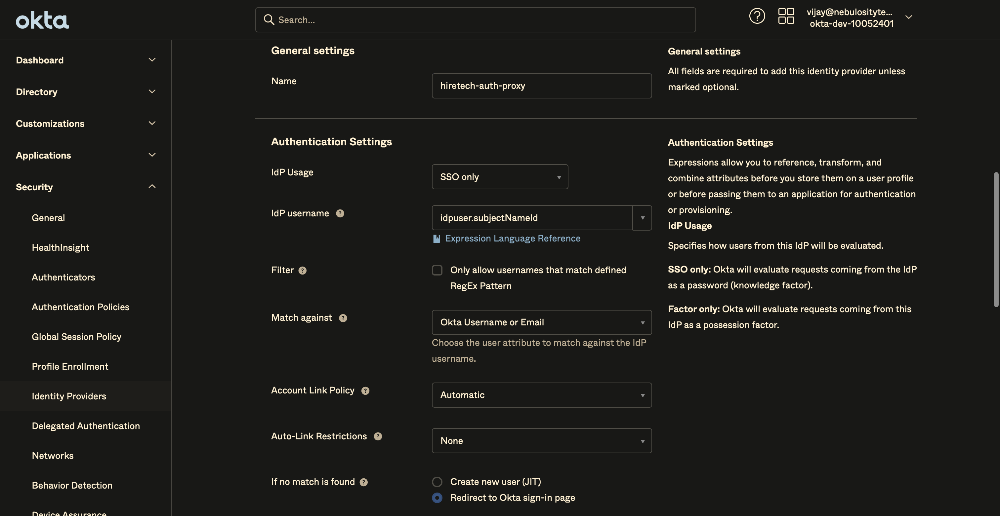
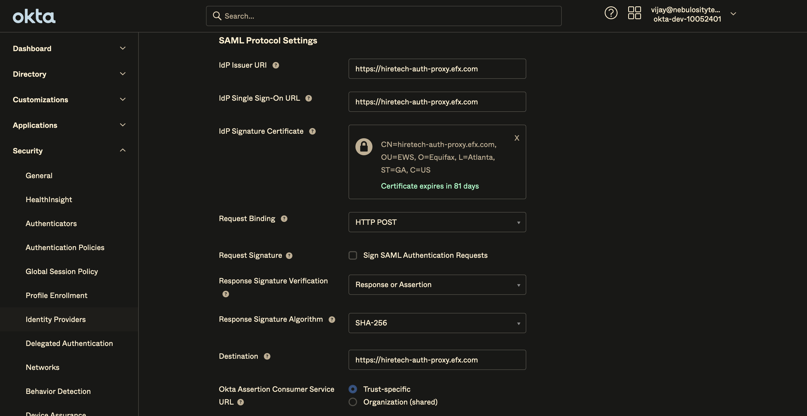
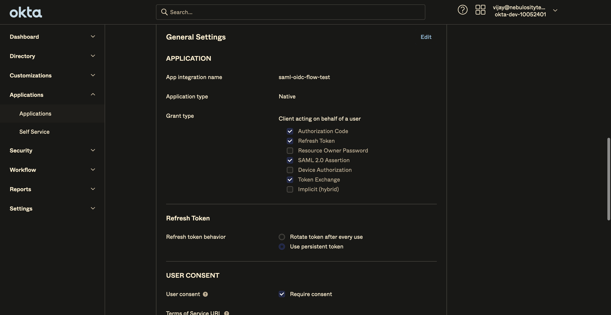

# SAML Assertion generation in Scala using OpenSaml & IDP initiation to Okta

## Intro

In this article lets learn how a SAML Assertion Or SAML Response can be generated in Scala using OpenSaml. I have recently run into a situation for legacy reasons where a proxy component has to act as an identity provider(IDP) and establish trust relationship with Okta(Service Provider) with JIT Provisioning. Since I have no real IDP implementation at disposal, I was forced to use a low level library to generate the assertion.

## OpenSaml

OpenSAML is a set of open source Java libraries used in support of the Shibboleth Project's implementation of the Security Assertion Markup Language (SAML). The OpenSAML libraries do not provide a complete SAML identity or service provider. It is based on java 11 and supports SAML 2.0. Spring Security uses opensaml under the hood.

### SAML Assertion

Below is a sample assertion token that we will be generating. An assertion contains few important elements Issuer, Signature, Subject, Conditions, AuthnStatement & AttributeStatement. Generated Assertion will be signed by x509 certificate.

```xml
<?xml version="1.0" encoding="UTF-8"?>
<saml2:Assertion xmlns:saml2="urn:oasis:names:tc:SAML:2.0:assertion"
    ID="f88c6ba8-669b-4c5a-8593-49dc154fc3d3" IssueInstant="2023-03-06T18:57:50.769Z" Version="2.0"
    xmlns:xsd="http://www.w3.org/2001/XMLSchema">
    <saml2:Issuer>https://hiretech-auth-proxy.efx.com</saml2:Issuer>
    <ds:Signature xmlns:ds="http://www.w3.org/2000/09/xmldsig#">
        <ds:SignedInfo>
            <ds:CanonicalizationMethod Algorithm="http://www.w3.org/2001/10/xml-exc-c14n#" />
            <ds:SignatureMethod Algorithm="http://www.w3.org/2001/04/xmldsig-more#rsa-sha256" />
            <ds:Reference URI="#f88c6ba8-669b-4c5a-8593-49dc154fc3d3">
                <ds:Transforms>
                    <ds:Transform Algorithm="http://www.w3.org/2000/09/xmldsig#enveloped-signature" />
                    <ds:Transform Algorithm="http://www.w3.org/2001/10/xml-exc-c14n#">
                        <ec:InclusiveNamespaces xmlns:ec="http://www.w3.org/2001/10/xml-exc-c14n#"
                            PrefixList="xsd" />
                    </ds:Transform>
                </ds:Transforms>
                <ds:DigestMethod Algorithm="http://www.w3.org/2001/04/xmlenc#sha256" />
                <ds:DigestValue>2SaPGHuxSoNIo0jIHjK8OaFaEFJUgEv+C7LUbAkfosY=</ds:DigestValue>
            </ds:Reference>
        </ds:SignedInfo>
        <ds:SignatureValue>
            euL7q6WCSvGM6D2gW4RkCjYnx9QVg9nGvr85EqP6ykTvH/oT27id/Am9ttZydprv6c1HTL6q8lgESLzf+ebmST9VnSTeNUZCKNHxNOLC/78wJRrl0dAuyRTuM20Nx77gVy09HjVKk+zOJYyRN3+dFHVvo6LKhqf1yrrMFiyJAqF4/fcPnlP+Z5bQjk4kp8rVzsmnd568HG0MYlAsUm6mhjN+jsAplE1NNADzPqsfByrJazbTgf+7fKIQzR7IoxzIjp608oB+qG4ZRRGObo9IEweT5tNpvzt7DA5T3eHLTq1Vf35lSu2pP1nxLl3OV/oOWCQydc9XiuhZZUQzlz+qt1lFWpkKkgMJB2GMRHGC5ES9Dh8atTnupqTLOk/rkfPo65xcxBEeT2JhtsY5oGHxofkj3mJlVvdDVRpw1RaHFfXULzSIey5GOTre9BVcFR5KFHQyFj0TfVAqgewvP1OLSx/H9HDp0RqRVs3hdr9++QEvTg26CWIczBoPYoHNc5vbyHReriB02Nzd0p0SBo6zp7DjvKEyqpByq3drcUBp/andu2J6XY7RVOZakc+zC8iRA9ner85xHzVVoO1ifC7AVK95E6ao/uNsMOWVh4KSf+FGcPaMLp4z0w7Xr2lWlwvPF0NUQ2lBMQcwK495TjDK7KHW3AABYqKjNzsT91q6vvQ=</ds:SignatureValue>
        <ds:KeyInfo>
            <ds:X509Data>
                <ds:X509Certificate>
                    MIIFiDCCA3CgAwIBAgIJALrNgec8PjYUMA0GCSqGSIb3DQEBDAUAMHIxCzAJBgNVBAYTAlVTMQswCQYDVQQIEwJHQTEQMA4GA1UEBxMHQXRsYW50YTEQMA4GA1UEChMHRXF1aWZheDEMMAoGA1UECxMDRVdTMSQwIgYDVQQDExtoaXJldGVjaC1hdXRoLXByb3h5LmVmeC5jb20wHhcNMjMwMjI3MDE0OTEwWhcNMjMwNTI4MDE0OTEwWjByMQswCQYDVQQGEwJVUzELMAkGA1UECBMCR0ExEDAOBgNVBAcTB0F0bGFudGExEDAOBgNVBAoTB0VxdWlmYXgxDDAKBgNVBAsTA0VXUzEkMCIGA1UEAxMbaGlyZXRlY2gtYXV0aC1wcm94eS5lZnguY29tMIICIjANBgkqhkiG9w0BAQEFAAOCAg8AMIICCgKCAgEAmsyxKczPOd7FQ+NN19zP+fNlApNh+zwkfMh4Bgl4rHl4EbqBjZppuv2izKAYSjuAM2sbQUD2j28Cav2Ofs5uB0EIWg0i+ujJrDC4DXLfltBhI4NP2SwfVm6LqPKqH/9G3pjVd9OhFgoxSW5T9ybTYd5Gp4CyL6f3nSogQHBFUzMdN9qwC2RDnBYFUvyH6Hv42nkrbDHk8o2eVO7OL3xV+9T2rPoIg5/IDgMqqTYkPf6eB/QW00hqFyan87QXiSp2JiPcR0+QHXfQrpnbnNMMnXcKGoyufnB1sUtyNP3T575Hum1xtxDB23KIbnLAufcvaZWnwg+LcaVSwUe20zcfY3kiE0XhHVtxg7cItSo5Veb7Tb/IUfhgdxVGV/oK+TW63zMSioPtz1O3djphSoTyCz3gS5c0p1FSUyLlSq4cCBbv37R69n/Yp40iInICxyAuI236eXNgwmBMN6mpIcY93MKOMVLfeyikfMJBqQ+y25+YLpdBG9N9mR/SGOdLISktG5VP6hO2LotaPtWSSD397BwmxpvlHVLVTdQuUjJQDylNq7fL4m8VocQyb6L/Ury5BBxWBRNZt36D3+QWJh9f+VJU1YAjGkR7JrkzTxXHaQdxu5p8IZVwyQQxR0La8ZZFENEBIEPNpzZ5p8iiEokz7VGgx9mL02QWwxp41kjnsrUCAwEAAaMhMB8wHQYDVR0OBBYEFOrqR8XRYnQnVSnDCGghTkbaS8aSMA0GCSqGSIb3DQEBDAUAA4ICAQCHy+9Iqvu2tJSzZaUoaas/7CoaElEAM8RhP6vHNBgQD5oJ2Y4cgrzYIRXLvk3FL82Xsz9xwTifx8U7W3MDXbiilmRtsZ1niOPQehmGHXRu1ssZkDiYb8/cNv/PC2nro16fSY3BI2lkx0+4Ub/LRjZmsmPvJWSQKUqXh78/cTPor7DlrseeEYNCUt0VUsLdE+aKoNqBCtFs3PcP2Vujc1RBcInTtU+lGhWyB+KkKUdm8avFnPVpKPf9UlHX4Evw5JEwMvLy/I+3HWu0C5TEBrpUMIQeEaVp7SrnxxzIWDmlanweTPbIBIZjpDp/TjC6SJBeGn9XH7hYRrJ+h1GweVnWJZYRBJyc2Ss5gTxkOhIuBp7F3iNFIsSX/QDxEFk9zOuYlyQz7KwwcO3ZwGz94fS8DoPVYxWwfxuhQQl6MqWWq5feLwqsExSJX7n2It+gqdZMqRPp+ycdJai0GaVHAjYcwZTWuxrS+ijcFW9fj2cvmIR8avQVQN3fVaE2ssWekZk1NBRaUvh+rzXnotGYuZG44PzdzsfCulkfG3S8S4Jz7BeqwGxreTWcKykqTIUfPSgop4mXNPIpRzfPXZO1S76oKtcT5gftyUJGQeL2wy/lE6HfOkZvy6OZ/xQVDq2C2r9ttyqm9SbUdZ6mVe7kkqa1/pCyD+SI9D0b78gxJV01qg==</ds:X509Certificate>
            </ds:X509Data>
        </ds:KeyInfo>
    </ds:Signature>
    <saml2:Subject>
        <saml2:NameID Format="urn:oasis:names:tc:SAML:1.1:nameid-format:unspecified">
            vijay@nebulositytech.com</saml2:NameID>
        <saml2:SubjectConfirmation Method="urn:oasis:names:tc:SAML:2.0:cm:bearer">
            <saml2:SubjectConfirmationData NotBefore="2023-03-06T18:57:50.838Z"
                NotOnOrAfter="2023-03-06T19:02:50.838Z"
                Recipient="https://dev-10052702.okta.com/sso/saml2/0oa8hl63lvaQwvasfasf" />
        </saml2:SubjectConfirmation>
    </saml2:Subject>
    <saml2:Conditions NotBefore="2023-03-06T18:57:50.841Z" NotOnOrAfter="2023-03-06T19:02:50.841Z">
        <saml2:OneTimeUse />
        <saml2:AudienceRestriction>
            <saml2:Audience>https://www.okta.com/saml2/service-provider/speyapkkuqlzzhisasdasd</saml2:Audience>
        </saml2:AudienceRestriction>
    </saml2:Conditions>
    <saml2:AuthnStatement AuthnInstant="2023-03-06T18:57:50.836Z"
        SessionIndex="f88c6ba8-669b-4c5a-8593-49dc154fc3d3"
        SessionNotOnOrAfter="2023-03-06T19:02:50.836Z">
        <saml2:AuthnContext>
            <saml2:AuthnContextClassRef>urn:oasis:names:tc:SAML:2.0:ac:classes:unspecified</saml2:AuthnContextClassRef>
        </saml2:AuthnContext>
    </saml2:AuthnStatement>
    <saml2:AttributeStatement>
        <saml2:Attribute Name="LastName">
            <saml2:AttributeValue xmlns:xsi="http://www.w3.org/2001/XMLSchema-instance"
                xsi:type="xsd:string">Akkineni</saml2:AttributeValue>
        </saml2:Attribute>
        <saml2:Attribute Name="FirstName">
            <saml2:AttributeValue xmlns:xsi="http://www.w3.org/2001/XMLSchema-instance"
                xsi:type="xsd:string">Vijay</saml2:AttributeValue>
        </saml2:Attribute>
        <saml2:Attribute Name="Email">
            <saml2:AttributeValue xmlns:xsi="http://www.w3.org/2001/XMLSchema-instance"
                xsi:type="xsd:string">vijay@nebulositytech.com</saml2:AttributeValue>
        </saml2:Attribute>
        <saml2:Attribute Name="mobilePhone">
            <saml2:AttributeValue xmlns:xsi="http://www.w3.org/2001/XMLSchema-instance"
                xsi:type="xsd:string">8888888888</saml2:AttributeValue>
        </saml2:Attribute>
        <saml2:Attribute Name="Locality">
            <saml2:AttributeValue xmlns:xsi="http://www.w3.org/2001/XMLSchema-instance"
                xsi:type="xsd:string">USA</saml2:AttributeValue>
        </saml2:Attribute>
    </saml2:AttributeStatement>
</saml2:Assertion>
```

Git repo for this article can be found [here](https://github.com/akkinenivijay/scala3-learn)

### Generate a self signed cert

A keystore with certificate and key can be generated using the below command.

```bash
keytool -keystore senderKeystore.jks -genkey -keyalg RSA -keysize 4096 -alias hiretech-auth-proxy.efx.com
```

We will be using this certificate to sign the assertion.

### Implementation in Scala

OpenSaml is a java library and so it can be easily consumed in a scala project. To get started add the following dependency to your build.sbt assuming sbt is your build system.

```sbt
libraryDependencies += "org.opensaml" % "opensaml-saml-impl" % "4.3.0"
```

Lets get started by building `XMLObjectBuilderFactory` which is a fctory for `XMLObjectBuilder`. `XMLObjectBuilder` is a builder for `XMLObjects`.

A scala function to generate `XMLObjectBuilderFactory`

```scala
private val xmlBuilderFactory: Try[XMLObjectBuilderFactory] =
    Try {
      val javaCryptoValidationInitializer = new JavaCryptoValidationInitializer
      javaCryptoValidationInitializer.init()
      val registry = new XMLObjectProviderRegistry
      ConfigurationService.register(
        classOf[XMLObjectProviderRegistry],
        registry
      )
      parserPool().map(parserPool => registry.setParserPool(parserPool))
      val factory: XMLObjectBuilderFactory =
        XMLObjectProviderRegistrySupport.getBuilderFactory
      InitializationService.initialize()
      factory
    }
```

Lets write a function that uses xmlBuilderFactory to generate a `XMLObjectBuilder`. Function has a type parameter `S` which is a sub type of `XMLObjectBuilder` and takes QName as input.

```scala
def xmlObjectBuilder[S <: XMLObjectBuilder[?]](
      qName: QName
  ): Try[S] =
    xmlBuilderFactory.map(factory =>
      factory
        .getBuilder(qName)
        .asInstanceOf[S]
    )
```

xmlObjectBuilder function in action to generate an XMLObject of type Signature. Once we have `Signature` object relevant properties can be populated.

```bash
scala> SamlXmlUtils.xmlObjectBuilder[SignatureBuilder](Signature.DEFAULT_ELEMENT_NAME)
val res0: util.Try[org.opensaml.xmlsec.signature.impl.SignatureBuilder] = Success(org.opensaml.xmlsec.signature.impl.SignatureBuilder@361d38a1)
scala> SamlXmlUtils.xmlObjectBuilder[SignatureBuilder](Signature.DEFAULT_ELEMENT_NAME).get.buildObject()
val res1: org.opensaml.xmlsec.signature.impl.SignatureImpl = org.opensaml.xmlsec.signature.impl.SignatureImpl@f4aefd3
```

Please refer to the scala object [`SamlAssertion`](https://github.com/akkinenivijay/scala3-learn/blob/main/src/main/scala/com/nebulosity/SamlAssertion.scala) ```assertion()``` for complete code to generate an Assertion in base64 encoded format.

```bash
scala> import com.nebulosity.SamlAssertion         
scala> SamlAssertion.assertion()
val res0: String = PD94bWwgdmVyc2lvbj0iMS4wIiBlbmNv//ommited for brevity
```

## Okta Setup

### IDP setup in Okta

Login to Okta and setup your IDP by navigating to "security" -> "identity providers". Upload your idp signature cert to okta for signature vaidation.




### Testing Assertion

In order to test the generated assertion we are going to use "SAML 2.0 Assertion Grant Type" to fetch an access token by providing our saml assertion. First create an `Application` in Okta which has saml 2.0 assertion grant type enabled.



Lets get the access token by posting to token endpoint with grant type `urn:ietf:params:oauth:grant-type:saml2-bearer`

```curl
curl --location 'https://dev-10052401.okta.com/oauth2/v1/token' \
--header 'Accept: application/json' \
--header 'Authorization: Basic MG9hOGhtdGduY0E' \
--header 'Content-Type: application/x-www-form-urlencoded' \
--data-urlencode 'grant_type=urn:ietf:params:oauth:grant-type:saml2-bearer' \
--data-urlencode 'scope=openid profile email' \
--data-urlencode 'assertion=PD94bWwgdmVyc2lvbj0iMS4wIiBlbm'
```

the response looks like this.

```json
{
    "token_type": "Bearer",
    "expires_in": 360,
    "access_token": "eyJraWQiOiJsRTdDV0xnbDRETzQtY0FXUWh2VGVKVlhUVkIxaWF3QnNHeUlkQ2JjTl9RIiwiYWxnIjoiUlMyNTYifQ.eyJ2ZXIiOjEsImp0aSI6IkFULkJiTGJRMXZ4TTFrVUtnWHdlQmRwVGF3aWQ0QktKWmo4SlpBOXpkc20za1kiLCJpc3MiOiJodHRwczovL2Rldi0xMDA1MjQwMS5va3RhLmNvbSIsImF1ZCI6Imh0dHBzOi8vZGV2LTEwMDUyNDAxLm9rdGEuY29tIiwic3ViIjoiYWtraW5lbmkudmlqYXlAZ21haWwuY29tIiwiaWF0IjoxNjc4MTI5MzkxLCJleHAiOjE2NzgxMjk3NTEsImNpZCI6IjBvY",
    "scope": "openid profile email",
    "id_token": "eyJraWQiOiJXZktVXzJ6QVUwa3R4aDBmZU1maVF4Z3BjU2V1dzd1QXJCTkxHTGJwSllvIiwiYWxnIjoiUlMyNTYifQeyJzdWIiOiIwMHU4aG54MDFmdkJRZk82b"
}
```

Hope you have learnt how to generate a saml token using opensaml and integrate it with okta using idp initiation.
